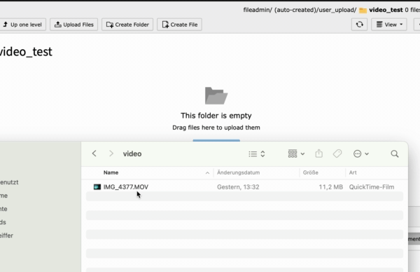

[](https://packagist.org/packages/hn/video)
[](https://packagist.org/packages/hn/video)
[](https://packagist.org/packages/hn/video)
[](https://packagist.org/packages/hn/video)

## what does this extension do

- At the moment, this extension compresses videos during the upload process to 720p h264 mp4 file using a [web assembly version of ffmpeg](https://ffmpegwasm.netlify.app).
  - This allows you to serve well compressed videos in a universally compatible format
  - It save storage space on your server by not uploading the original files
  - It potentially helps users upload videos that have a slow internet connection



## installation

You usually just need to install and activate this extension.
The JavaScriptModules definition is used to overwrite Typo3's drag-uploader module.
You can verify it by checking the developer console while uploading videos (and likely by your computers fans spinning).

If you webserver has no support for `.htaccess` files, then you need to set some headers for the javascript files of this extension (or all files).
```
Cross-Origin-Opener-Policy: same-origin
Cross-Origin-Embedder-Policy: require-corp
```
These headers are automatically set using a middleware for the backend itself.
Here is the explanation why this is required:  
https://developer.mozilla.org/en-US/docs/Web/JavaScript/Reference/Global_Objects/SharedArrayBuffer#security_requirements  
In short: It will prevent a 3rd party site from embedding resources from your backend. It is a security requirement to use some timing critical browser api's.

## known issues

- Empty folders in the Filelist have an upload button that avoids the drag-uploader in TYPO3 13.

## future plans

- allow for quality configuration
  - the 720p default is a pretty good compromise between quality, compatibility and file size, but you might have different requirements
- create posters and thumbnails for video files
  - this would allow to populate the poster property of the `<video>` tag as a placeholder before playing the video
  - it could give a better overview within the fileadmin, where videos currently have no thumbnail/preview
- hook into the file upload process to create HLS video fragments
  - reliably serve your videos to clients with a bad connection by offering different resolutions
  - can improve upload speeds with slow internet connections
  - avoid max upload size limits on your hoster
  - Cut videos by just modifying the playlist file. e.g. cut out the audio etc. Maybe even a tiny video editor in the backend.
- implement some form of optional server side video conversion
  - allows to use more complex video formats like av1 (which would take forever in wasm)
  - reduces requirements on the client computer (although increases internet bandwith requirement)

Video compression is done within the browser so there is no server dependency for video compression.

## v1 vs v2

The old v1 video extension did work completely differently.
It assumed that you upload original video files and that you want to exactly specify what format to use every time you embed a video.
It therefore had to use server side video conversion or an api service.
It was way too complicated for most use cases.

v2 is a completely different extension with a much simpler approach that will likely fit more users.